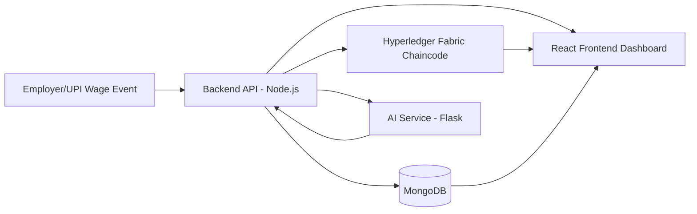

# TRACIENT

Blockchain-Based Income Traceability System for Equitable Welfare Distribution

TRACIENT is a full-stack platform that combines Hyperledger Fabric, AI/ML, and a government-facing analytics dashboard to make welfare targeting more accurate, transparent, and resistant to manipulation.

## Table of Contents

- [1. Core Idea](#1-core-idea)
- [2. Problem Statement](#2-problem-statement)
- [3. Proposed Solution](#3-proposed-solution)
- [4. System Architecture](#4-system-architecture)
- [5. Repository Structure](#5-repository-structure)
- [6. Key Features](#6-key-features)
- [7. Technology Stack](#7-technology-stack)
- [8. End-to-End Data Flow](#8-end-to-end-data-flow)
- [9. Prerequisites](#9-prerequisites)
- [10. Quick Start (Local Development)](#10-quick-start-local-development)
- [11. Configuration](#11-configuration)
- [12. Module Guides](#12-module-guides)
- [13. API Overview](#13-api-overview)
- [14. AI Models and Services](#14-ai-models-and-services)
- [15. Blockchain Layer](#15-blockchain-layer)
- [16. Testing and Validation](#16-testing-and-validation)
- [17. Limitations and Deployment Challenges](#17-limitations-and-deployment-challenges)
- [18. Feasibility Notes](#18-feasibility-notes)
- [19. Security and Privacy Notes](#19-security-and-privacy-notes)
- [20. Roadmap](#20-roadmap)
- [21. Conclusion](#21-conclusion)

## 1. Core Idea

TRACIENT turns income verification from survey-based self-reporting into a verifiable digital pipeline:

1. Wage and payment events are captured as structured records.
2. Records are anchored in a tamper-resistant ledger.
3. AI models estimate income patterns, classify BPL/APL, and flag anomalies.
4. Government dashboards show eligibility and fraud-risk insights in near real time.

## 2. Problem Statement

Traditional income intelligence for welfare administration struggles with:

- Incomplete and outdated datasets
- Data manipulation through self-declarations
- Weak coverage of informal workers
- Poor traceability and auditability

This causes leakage (ineligible inclusion), exclusion (eligible people left out), and weak policy outcomes.

## 3. Proposed Solution

TRACIENT uses a hybrid architecture:

- Blockchain Layer: Immutable wage/payment trail using Hyperledger Fabric
- AI/ML Layer: Classification and anomaly detection
- Application Layer: Role-based workflows for workers, employers, administrators, and government officials
- Dashboard Layer: Monitoring, policy analytics, and anomaly review

## 4. System Architecture



## 5. Repository Structure

```text
.
├── backend/                 # Node.js + Express API, auth, business logic, integrations
├── frontend/                # React + TypeScript dashboard and user flows
├── blockchain/              # Hyperledger Fabric network scripts + Go chaincode
├── ai-model/                # ML training, inference API, and model artifacts
├── details/                 # Project reports, roadmaps, and documentation notes
├── fabric-samples/          # Hyperledger reference samples (vendored)
└── install-fabric.sh        # Fabric installation helper
```

## 6. Key Features

- Income traceability through transaction-centric records
- BPL/APL classification with model + rule-based fallback
- AI-powered anomaly scanning and alert generation
- Hyperledger Fabric chaincode for wage and identity operations
- Role-aware UI flows for worker/employer/government/admin
- QR and UPI-linked payment simulation endpoints for prototype workflows

## 7. Technology Stack

- Frontend: React, TypeScript, Vite
- Backend: Node.js 18+, Express, Mongoose, JWT
- Database: MongoDB
- Blockchain: Hyperledger Fabric (permissioned), Go chaincode
- AI/ML: Python, Flask, scikit-learn, Isolation Forest, Random Forest
- Visualization: Recharts

## 8. End-to-End Data Flow

1. Wage/payment data is submitted digitally (application APIs, QR/UPI simulation in prototype).
2. Backend validates identities, roles, and schema.
3. Data is persisted to MongoDB and optionally written to Fabric chaincode.
4. Family/worker data is evaluated by AI service for classification and anomaly signals.
5. Government dashboards aggregate metrics, anomalies, and eligibility state.

## 9. Prerequisites

### Base (all modules)

- Node.js >= 18
- npm >= 9
- Git

### Backend

- MongoDB (local or remote URI)

### AI Service

- Python >= 3.10
- pip

### Blockchain (recommended on Windows)

- Windows 11 + WSL2 (Ubuntu)
- Docker Desktop with WSL integration
- Go >= 1.21 (inside WSL)

## 10. Quick Start (Local Development)

Open separate terminals from repository root.

### 10.1 Backend

```bash
cd backend
npm install
npm run dev
```

Default API base: `http://localhost:5000/api`

### 10.2 Frontend

```bash
cd frontend
npm install
npm run dev
```

Default app URL: `http://localhost:5173`

### 10.3 AI API (optional but recommended)

```bash
cd ai-model/apl_bpl_model
pip install -r requirements.txt
python api.py
```

Default AI API URL expected by backend constants: `http://localhost:5001`

### 10.4 Blockchain Network (optional for full ledger mode)

From PowerShell:

```powershell
cd blockchain
.\start-network.ps1
```

From WSL:

```bash
cd blockchain
./start-network.sh
```

## 11. Configuration

Create and tune environment variables per module.

### 11.1 Backend (`backend/.env`)

Common settings used by the codebase:

```env
PORT=5000
NODE_ENV=development
MONGODB_URI=mongodb://localhost:27017/tracient
CORS_ORIGIN=http://localhost:5173

JWT_SECRET=change-me
JWT_REFRESH_SECRET=change-me-too
JWT_EXPIRY=24h
JWT_REFRESH_EXPIRY=7d

BPL_THRESHOLD=120000
FRONTEND_URL=http://localhost:5173

# AI integration
AI_API_URL=http://localhost:5001
AI_API_TIMEOUT=30000
AI_ENABLED=true

# Fabric integration toggle
FABRIC_ENABLED=false
FABRIC_CHANNEL=mychannel
FABRIC_CHAINCODE=tracient
FABRIC_MSP_ID=Org1MSP
```

### 11.2 Frontend (`frontend/.env`)

```env
VITE_API_URL=http://localhost:5000/api
VITE_BLOCKCHAIN_EXPLORER_URL=http://localhost:8080
```

## 12. Module Guides

- Backend guide: `backend/README.md`
- Blockchain quick start: `blockchain/QUICK_START.md`
- Blockchain setup details: `blockchain/BLOCKCHAIN_SETUP_GUIDE.md`
- AI overview: `ai-model/README.md`
- APL/BPL model docs: `ai-model/apl_bpl_model/README.md`
- Anomaly model docs: `ai-model/anomaly_detection_model/README.md`

## 13. API Overview

Main API groups are mounted under `/api`:

- `/api/health`
- `/api/auth`
- `/api/workers`
- `/api/wages`
- `/api/upi` and `/api/qr`
- `/api/government`
- `/api/employers`
- `/api/admin`
- `/api/analytics`
- `/api/blockchain`
- `/api/family`
- `/api/iam`

For endpoint-level request/response examples, start with `backend/README.md` and route/controller files in `backend/routes` and `backend/controllers`.

## 14. AI Models and Services

### APL/BPL Classification

- Service file: `ai-model/apl_bpl_model/api.py`
- Endpoint: `POST /classify`
- Includes ML output and SECC-style rule interpretation
- Backend applies additional policy screening before final classification

### Anomaly Detection

- Endpoint: `POST /detect-anomaly`
- Batch endpoint: `POST /batch-detect-anomaly`
- Uses pattern-based signals (not fixed income thresholds)
- Backend government flows can trigger anomaly scans and generate alerts

### Fallback Behavior

If AI API is unavailable, backend services use rule-based fallback logic for classification to keep workflows functional.

## 15. Blockchain Layer

Blockchain module provides:

- Fabric test network lifecycle scripts
- Go chaincode for wage records, identity, poverty checks, anomalies, and compliance
- Scripted deploy/restart/test utilities

Core scripts in `blockchain/`:

- `start-network.sh` / `start-network.ps1`
- `restart-network.sh` / `restart-network.ps1`
- `deploy-chaincode.sh` / `deploy-chaincode.ps1`
- `test-chaincode.sh` / `test-chaincode.ps1`
- `fresh-start.sh` / `fresh-start.ps1`

## 16. Testing and Validation

### Backend

```bash
cd backend
npm test
```

Additional utility scripts exist in `backend/` for seeding and environment checks (for example, `create-test-accounts.js`, `verify-database.js`, `seed.js`).

### Blockchain

```bash
cd blockchain
./test-chaincode.sh
```

On Windows PowerShell:

```powershell
cd blockchain
.\test-chaincode.ps1
```

### AI

Use module-specific scripts in `ai-model/anomaly_detection_model` and `ai-model/apl_bpl_model` for training, inference, and API checks.

## 17. Limitations and Deployment Challenges

- High system complexity across multiple runtimes (Node, Python, Go, Fabric)
- Integration burden with existing national/state systems
- Infrastructure requirements for real-time, high-volume transaction processing
- Data governance and regulatory clarity needed for production-scale rollout
- Adoption challenges for informal workers without assisted digital channels

## 18. Feasibility Notes

- Operational feasibility improves with low-friction user channels (mobile app, assisted service points, SMS/IVR support)
- Economic feasibility depends on phased implementation and fraud-reduction ROI
- Technical feasibility depends on reliable streaming/event pipelines and robust observability

## 19. Security and Privacy Notes

- Use strict secret management for JWT, DB, and service credentials
- Store only hashed/least-privilege identity data where possible
- Apply role-based access and audit logging across sensitive operations
- Enforce encryption in transit and at rest in production deployments
- Conduct regular model drift, bias, and false-positive/negative reviews

## 20. Roadmap

1. Stabilize local end-to-end stack with reproducible environments.
2. Harden API contracts and auth/session flows.
3. Expand model validation using real anonymized transaction distributions.
4. Add production-grade observability, SLOs, and incident workflows.
5. Pilot phased deployment with bounded geography and policy feedback loops.

## 21. Conclusion

TRACIENT demonstrates how verifiable transaction trails + AI-driven analysis can modernize welfare eligibility assessment. The concept is strong and policy-relevant, while implementation is intentionally ambitious and best approached through phased deployment.

---

If you are evaluating or presenting this project, start with:

1. `README.md` (this file)
2. `blockchain/README.md`
3. `backend/README.md`
4. `ai-model/TRACIENT_AI_MODEL_SUMMARY.md`
